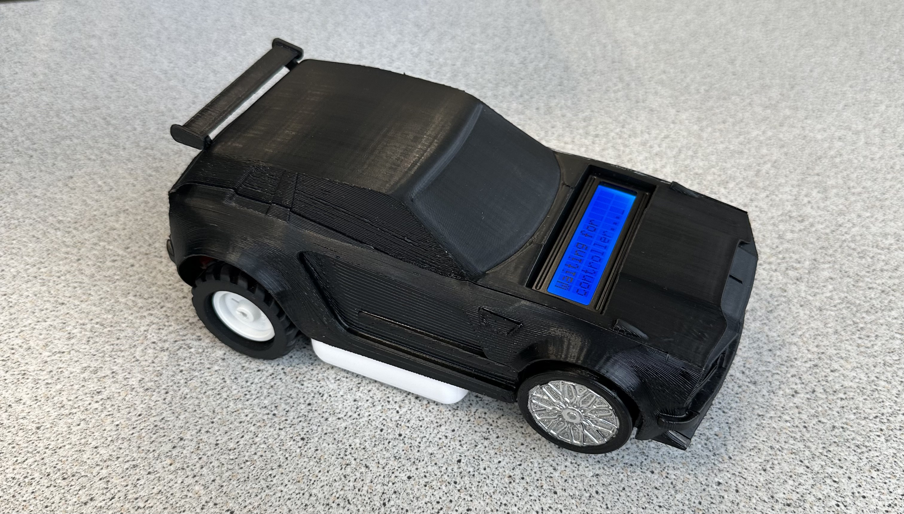
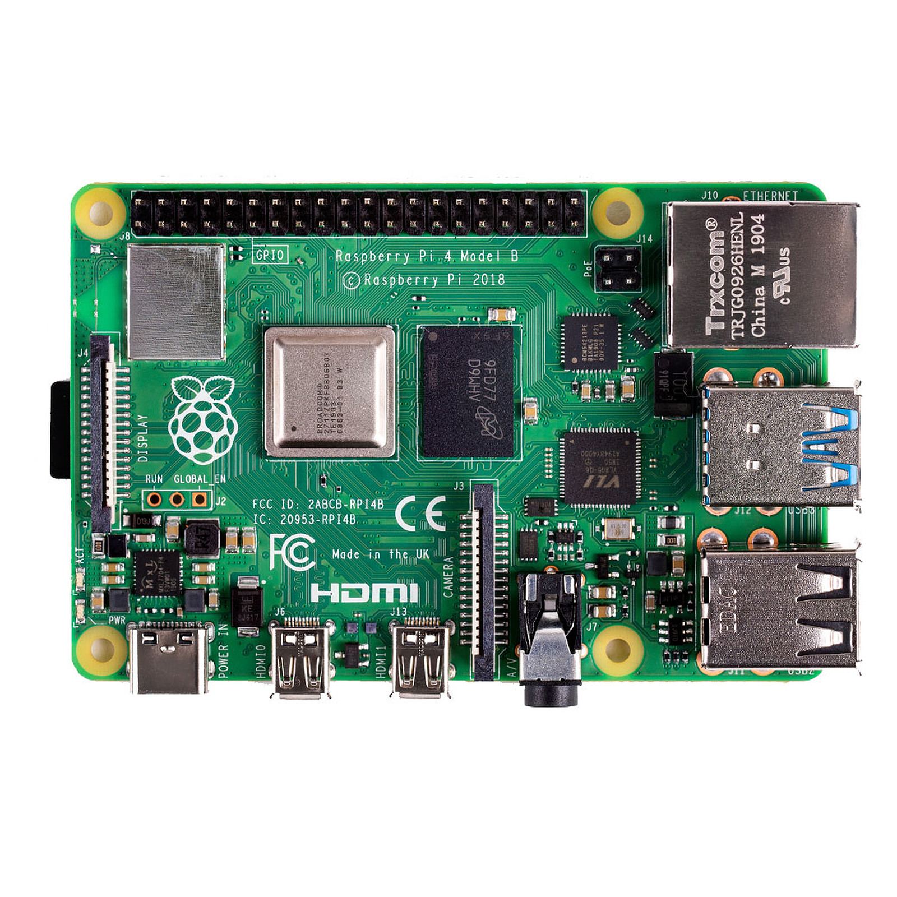
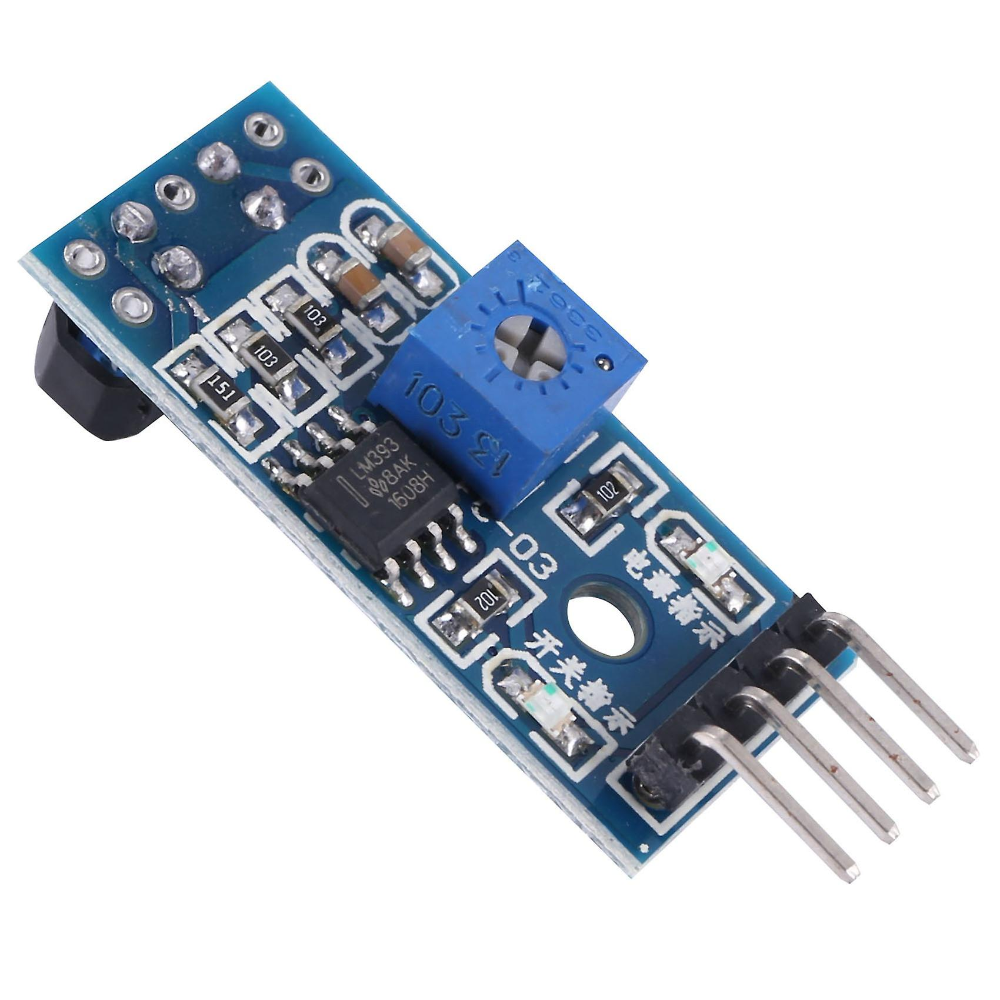
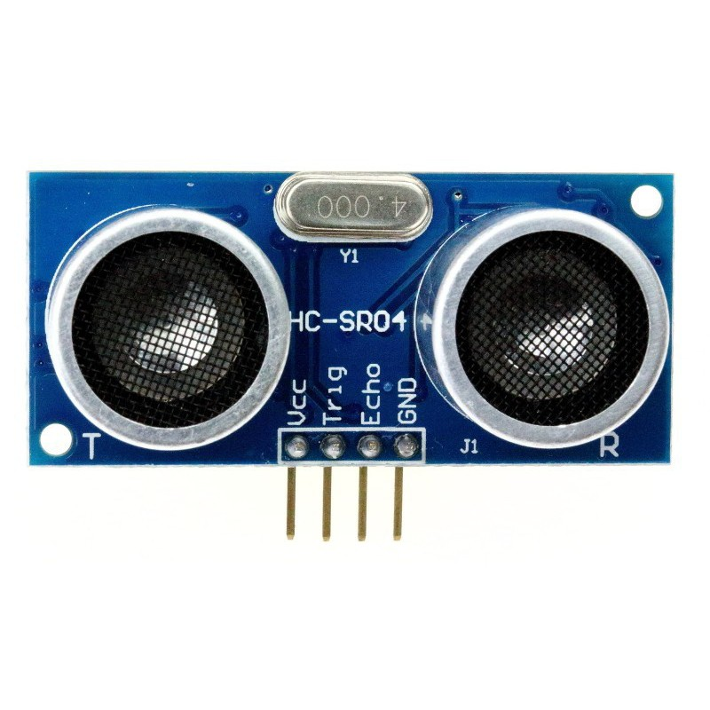
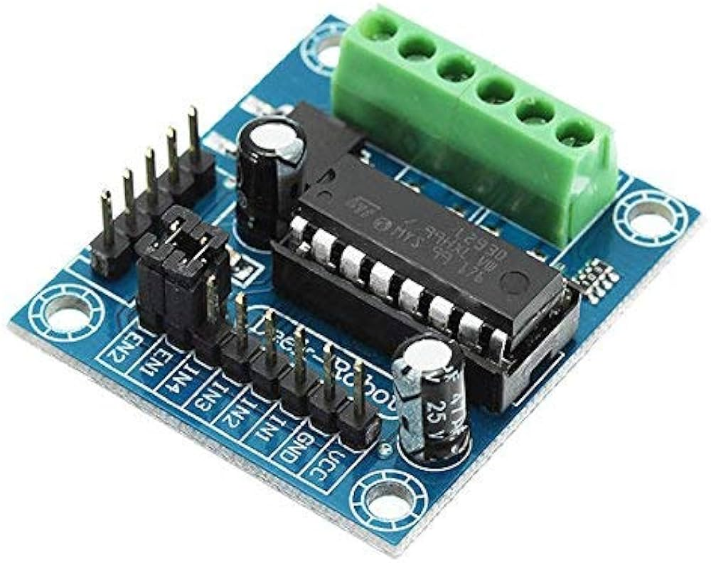
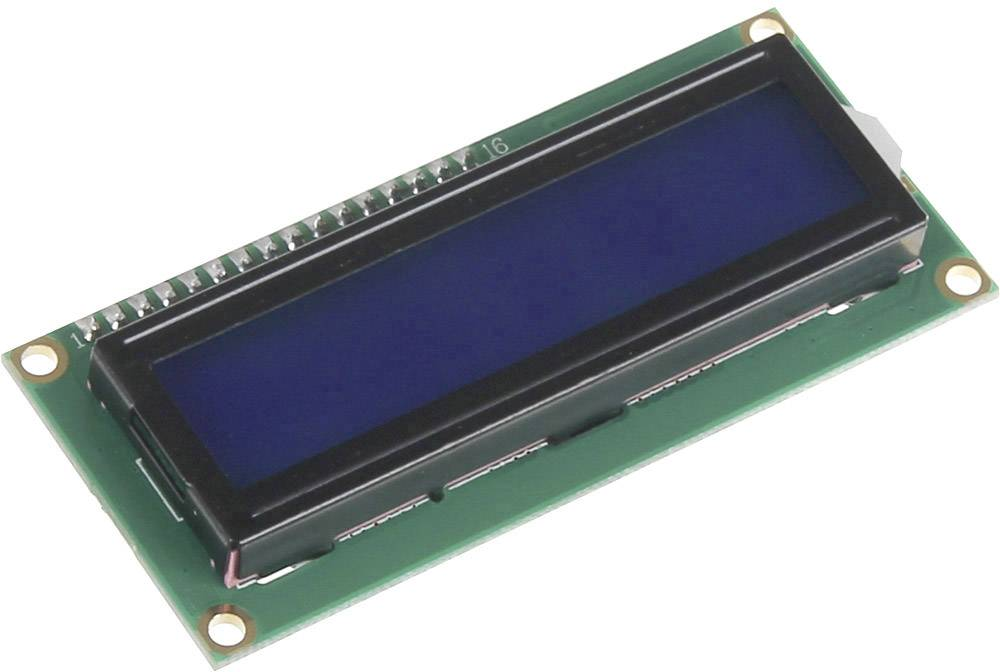
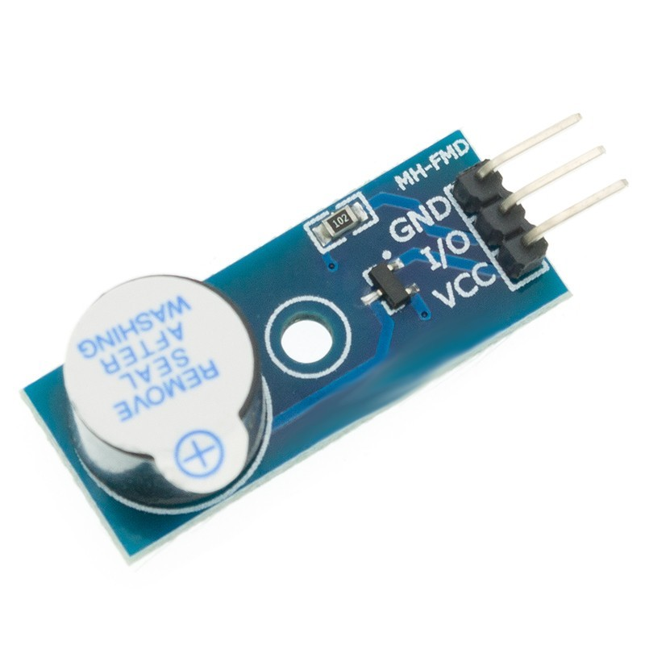

# Line Following Robot 🤖

<div align="center">



**Autonomous line-following robot with obstacle detection and PS5 controller support**

[](https://en.wikipedia.org/wiki/C_(programming_language))
[](https://www.raspberrypi.org/)
[](LICENSE)

*INSA Rouen Normandie - Embedded Electronics Project 2023-2024*

</div>

## 📋 Table of Contents

- [About](#-about)
- [Features](#-features)
- [Hardware Components](#-hardware-components)
- [Circuit Diagram](#-circuit-diagram)
- [Software Architecture](#-software-architecture)
- [Installation](#-installation)
- [Usage](#-usage)
- [Project Structure](#-project-structure)
- [Team](#-team)

## 🎯 About

This project is an autonomous line-following robot developed as part of the **Embedded Electronics Systems** course at INSA Rouen Normandie. The robot combines infrared line detection, ultrasonic obstacle avoidance, and manual control via a PS5 controller, all housed in a custom 3D-printed Rocket League-inspired chassis.

### Key Highlights

- **Dual Control Modes**: Autonomous line-following and manual PS5 controller
- **Safety Features**: Ultrasonic distance sensor with buzzer alerts
- **Real-time Display**: LCD screen showing status and distance information
- **Custom Hardware**: 3D-printed car body designed in SolidWorks
- **Low-level Programming**: Written entirely in C using WiringPi library

## ✨ Features

### Autonomous Mode
- ✅ **Line Following**: Three TCRT5000 infrared sensors for precise line tracking
- ✅ **Intersection Detection**: Recognizes and handles T-junctions and crossroads
- ✅ **Obstacle Detection**: HC-SR04 ultrasonic sensor with 20cm stop threshold
- ✅ **Audio Alerts**: Active buzzer for obstacle warnings
- ✅ **Visual Feedback**: LCD display showing movement status and distance

### Manual Control Mode
- 🎮 **PS5 Controller Support**: Full gamepad integration via SDL2
- 🚗 **Analog Control**: Smooth acceleration and steering using triggers and joystick
- 📊 **Speed Display**: Real-time speed indicator on LCD screen
- 🔄 **Mode Switching**: Instant toggle between autonomous and manual modes

## 🔧 Hardware Components

| Component | Model | Function |
|-----------|-------|----------|
| **Microcontroller** | Raspberry Pi 4 | Main control unit |
| **Line Sensors** | TCRT5000 (×3) | Infrared line detection |
| **Distance Sensor** | HC-SR04 | Ultrasonic obstacle detection |
| **Motor Driver** | L293D | Dual H-bridge motor controller |
| **Display** | LCD 1602 I2C | Status and distance display |
| **Buzzer** | Active Buzzer | Obstacle alert |
| **Controller** | PS5 DualSense | Manual control (Bluetooth) |
| **Motors** | DC Motors (×2) | Wheel propulsion |
| **Power** | 9V Battery + External Pack | Raspberry Pi and motors |

### Component Images

<details>
<summary>View Hardware Components</summary>

<table>
<tr>
<td><br/><b>Raspberry Pi 4</b></td>
<td><br/><b>TCRT5000 Sensor</b></td>
<td><br/><b>HC-SR04</b></td>
</tr>
<tr>
<td><br/><b>L293D Driver</b></td>
<td><br/><b>LCD 1602</b></td>
<td><br/><b>Active Buzzer</b></td>
</tr>
</table>

</details>

## 📐 Circuit Diagram

The complete circuit was designed using **Fritzing** and includes GPIO pin mappings for all components.

<details>
<summary>View Circuit Schematics</summary>

### Component Layout


### Electronic Schematic


</details>

### GPIO Pin Configuration

```c
// Line Finder Sensors
#define PIN_LINEFINDER_LEFT    17
#define PIN_LINEFINDER_CENTER  22
#define PIN_LINEFINDER_RIGHT   10

// Ultrasonic Sensor
#define PIN_TRIG  25
#define PIN_ECHO  8

// Motor Driver (L293D)
#define PIN_EN1   13  // PWM Enable Motor 1
#define PIN_EN2   12  // PWM Enable Motor 2
#define PIN_M1A   5   // Motor 1 Direction A
#define PIN_M1B   6   // Motor 1 Direction B
#define PIN_M2A   26  // Motor 2 Direction A
#define PIN_M2B   21  // Motor 2 Direction B

// Buzzer
#define PIN_BUZZER 14
```

## 🏗️ Software Architecture

The project is structured using a modular approach with separate modules for each hardware component.

### Code Organization

```
src/
├── main.c           # Main program with event loop
├── motors.c         # Motor control (PWM, direction)
├── lineFinder.c     # Line detection logic
├── distance.c       # Ultrasonic sensor readings
├── controller.c     # PS5 gamepad handling (SDL2)
├── i2cLCD.c        # LCD display communication
└── buzzer.c        # Buzzer control

include/
├── motors.h
├── lineFinder.h
├── distance.h
├── controller.h
├── i2cLCD.h
├── buzzer.h
└── gpioPins.h      # GPIO pin definitions
```

### Key Algorithms

#### Line Following Logic

```c
// Truth table for line following
// L | C | R | Action
// --+---+---+------------------
// 0 | 0 | 0 | Keep previous state
// 0 | 0 | 1 | Turn right
// 0 | 1 | 0 | Move forward
// 0 | 1 | 1 | Move forward (intersection)
// 1 | 0 | 0 | Turn left
// 1 | 0 | 1 | Move forward (intersection)
// 1 | 1 | 0 | Move forward (intersection)
// 1 | 1 | 1 | Move forward (intersection)
```

#### PWM Motor Control

The robot uses hardware PWM with adaptive speed control based on steering angle:

```c
// Speed adjustment for turning
if (angle < 0) {  // Turning left
    leftMotorSpeed = baseSpeed * (1 - |angle| / MAX_ANGLE);
    rightMotorSpeed = baseSpeed;
} else {  // Turning right
    leftMotorSpeed = baseSpeed;
    rightMotorSpeed = baseSpeed * (1 - angle / MAX_ANGLE);
}
```

## 🚀 Installation

### Prerequisites

```bash
# Update system
sudo apt update && sudo apt upgrade

# Install required libraries
sudo apt install -y \
    build-essential \
    git \
    wiringpi \
    libsdl2-dev \
    libi2c-dev

# Enable I2C interface
sudo raspi-config
# Navigate to: Interfacing Options → I2C → Enable
```

### Building the Project

```bash
# Clone the repository
git clone git@github.com:nlegendree/line-following-robot.git
cd line-following-robot

# Compile the project
make

# The executable will be created in bin/rc
```

### Hardware Setup

1. **Connect all components** according to the Fritzing diagram
2. **Pair PS5 controller** via Bluetooth settings
3. **Calibrate line sensors** on your track surface
4. **Test motors** individually before full assembly

## 📖 Usage

### Running the Robot

```bash
# Start the program (requires sudo for GPIO access)
sudo ./bin/rc
```

### Controls

#### Autonomous Mode
- Press **Cross (×)** button to activate line-following mode
- The robot will:
  - Follow black lines automatically
  - Stop when obstacles are < 20cm away
  - Display distance on LCD when obstacles are detected
  - Sound buzzer for close obstacles

#### Manual Mode
- Press **Circle (○)** button to activate manual control
- **R2 Trigger**: Accelerate forward
- **L2 Trigger**: Reverse
- **Left Stick (horizontal)**: Steering
- **LCD Display**: Shows current speed

### Mode Indicators

| LCD Display | Meaning |
|-------------|---------|
| `Waiting for controller...` | No controller connected |
| `Speed: XX kph` | Manual mode active |
| `Moving forward` | Line-following: going straight |
| `Turning left/right` | Line-following: adjusting direction |
| `Obstacle: XX cm` | Warning distance display |
| `Obstacle too close!` | Emergency stop (< 20cm) |

## 📁 Project Structure

```
line-following-robot/
├── bin/                    # Compiled executables
├── src/                    # C source files
│   ├── main.c
│   ├── motors.c
│   ├── lineFinder.c
│   ├── distance.c
│   ├── controller.c
│   ├── i2cLCD.c
│   └── buzzer.c
├── include/                # Header files
│   ├── motors.h
│   ├── lineFinder.h
│   ├── distance.h
│   ├── controller.h
│   ├── i2cLCD.h
│   ├── buzzer.h
│   └── gpioPins.h
├── images/                 # Project images
│   ├── components/        # Component photos
│   ├── fritzing/          # Circuit diagrams (PDF)
│   ├── solidworks/        # 3D model screenshots
│   └── voiture.jpeg       # Final robot photo
├── circuit/               # Fritzing project files
├── makefile              # Build configuration
├── LICENSE               # MIT License
└── README.md             # This file
```

## 👥 Team

This project was developed collaboratively by a **team of four engineering students** at INSA Rouen Normandie as part of the Embedded Electronics Systems course.

**Academic Year**: 2023-2024
**Institution**: [INSA Rouen Normandie](https://www.insa-rouen.fr/)

## 🎓 Acknowledgments

Special thanks to:

- Our project supervisor for guidance and support
- INSA Rouen Normandie Electronics Department for lab resources and equipment
- Rocket League for design inspiration (3D chassis model)

## 📄 License

This project is available under the MIT License. See [LICENSE](LICENSE) for details.

---

<div align="center">

**Made with ❤️ at INSA Rouen Normandie**

⭐ Star this repo if you found it helpful!

</div>
